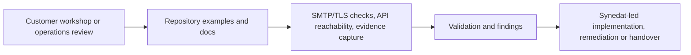

# Seppmail-HealthChecks

       

> Synedat-led health checks, operational readiness reviews and evidence-oriented verification patterns for SEPPmail-related environments.

This repository is structured as a **customer-facing technical sales and delivery starter** for teams that want to evaluate, harden or operationalize SEPPmail-related environments with **Synedat Group GmbH** as their engineering and implementation contact.

Official SEPPmail pages state that accredited partners support customers with evaluation, introduction and maintenance of the secure email solution, and that SEPPmail works with certified systems integrators and cloud solution providers. This repository is therefore positioned as a practical conversation asset for discovery workshops, pilot preparation, implementation planning and recurring operational verification. See docs/SEPPMAIL-REFERENCES.md for the official source trail.

## What this repository is for

The focus is **SMTP/TLS checks, API reachability, response normalization, recurring evidence collection and operational readiness validation** around SEPPmail-centric environments.

Use it to move from isolated commands or scripts to a more reviewable, reusable and customer-presentable baseline for:

- health checks before or after change windows
- pilot and acceptance preparation
- runbook creation and operations onboarding
- evidence capture for governance-oriented environments
- delivery conversations around managed or project-based services

## Why this works as a sales engineering asset

SEPPmail publicly highlights capabilities such as automatic encryption and decryption, support for S/MIME, OpenPGP, TLS and SSL, GINA technology, high availability, monitoring and reporting, LDAP/AD integration and cluster-capable enterprise operation. This repository translates that product context into a practical operational story that Synedat can discuss, demonstrate and adapt with customers. See docs/SEPPMAIL-REFERENCES.md for the official product reference.

## What customers can do with it

- verify whether SMTP/TLS paths behave as expected
- test API and login reachability where permitted
- create lightweight evidence bundles for reviews and change records
- discuss readiness, findings and next implementation steps with Synedat
- use examples as a starting point for customer-specific automation

## Synedat role in the customer journey

Synedat is positioned here as the **delivery and implementation layer** around SEPPmail-related environments:

- workshop and discovery support
- health-check and readiness assessments
- architecture and integration review
- automation and scripting support
- operations handover and evidence-oriented documentation

Website: https://www.synedat.com/

## Repository highlights

- practical examples instead of placeholder-only content
- documentation for architecture, permissions, operations and evidence handling
- reusable guidance for change-safe execution
- customer-conversation-ready landing page and workshop material
- explicit source notes for vendor-facing claims and product references

## Main building blocks

- TLS and SMTP checks
- API and login probes
- checklists and smoke-test guidance
- reporting starter assets
- workshop and demo material
- sales-facing positioning copy for landing pages and presentations

## Quick start

1. Run a DNS/TLS smoke test against a non-production target.
2. Add API reachability checks if credentials are available.
3. Capture the results into your ticketing, evidence or operations review workflow.
4. Use the report and findings as input for a Synedat-led remediation, tuning or implementation discussion.

## Typical engagement triggers

- secure email rollout preparation
- post-change verification after gateway or routing adjustments
- operations baseline creation for managed service handover
- compliance-oriented evidence collection
- implementation workshops for SEPPmail-related integrations

## Suggested customer call to action

- start with the README and the landing page
- review the architecture, permissions and operations material
- use the examples as a discovery or pilot baseline
- contact Synedat for workshops, readiness checks or customer-specific extensions

## Official SEPPmail references and source notes

- `docs/SEPPMAIL-REFERENCES.md`
- `docs/IMAGE-SOURCES.md`
- `docs/SALES-REPOSITIONING.md`

## Documentation map

- `docs/ARCHITECTURE.md`
- `docs/RBAC-AND-PERMISSIONS.md`
- `docs/SECURITY-AND-COMPLIANCE.md`
- `docs/SEPPMAIL-REFERENCES.md`
- `docs/USE-CASES.md`
- `docs/THREAT-MODEL.md`
- `docs/OBSERVABILITY.md`
- `docs/CONTROL-MAPPING.md`
- `docs/ADOPTION-GUIDE.md`
- `docs/CHANGE-MANAGEMENT.md`
- `docs/EVIDENCE-AND-AUDIT.md`
- `docs/EXTENSIONS-AND-ROADMAP.md`
- `docs/OPERATIONS.md`
- `docs/TROUBLESHOOTING.md`
- `docs/DIAGRAMS.md`

## Example catalogue

- `examples/Test-SeppmailTls.ps1`
- `examples/checklist.md`
- `examples/test-api-login.sh`
- `examples/test-dns-and-tls.py`
- `examples/test-message-flow.py`

## Architecture at a glance

Additional visuals:
- `docs/images/architecture-overview.svg`
- `docs/images/trust-boundaries.svg`
- `docs/images/operations-lifecycle.svg`

## Security and governance note

This repository is written as implementation guidance, demo material and operational starter content. It can support evidence-oriented work for information security and operational resilience, but it does not replace formal policy, legal interpretation, certification scope or vendor support statements.

## SEPPmail product context used in this repository

SEPPmail presents the Secure Email Gateway as a solution for automatic email encryption and decryption, support for common encryption standards, GINA-based recipient handling, enterprise-grade availability, monitoring integration and directory integration. Those public product capabilities are the context for the health-check and operations patterns shown here. See docs/SEPPMAIL-REFERENCES.md for the official product reference.

## Visual and landing assets

- `docs/index.md`
- `docs/site/index.md`
- `pages/index.html`
- `docs/LANDING-PAGE-COPY.md`
- `docs/HOMEPAGE-STRUCTURE.md`
- `docs/WORKSHOP-KIT.md`
- `docs/COMMUNITY-AND-SOCIAL.md`
- `docs/images/repo-header.svg`
- `docs/images/homepage-hero.svg`
- external product image reference documented in `docs/IMAGE-SOURCES.md`

## Contribution style

Contributions are welcome when they improve usefulness, safety, reviewability, documentation quality or customer-facing clarity. Prefer examples that are realistic, least-privilege aware and easy to adapt.
